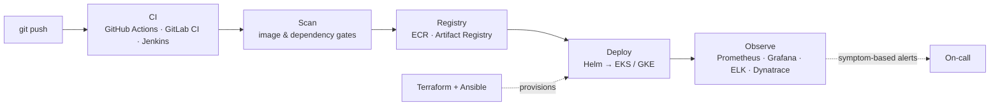

<h1 align="center">Hi, I'm Dipon Kumer Sarker 👋</h1>

<p align="center">
  <b>DevOps Engineer</b> · Kubernetes · Cloud Infrastructure · CI/CD · Observability<br/>
  📍 Dhaka, Bangladesh
</p>

<p align="center">
  <a href="https://www.linkedin.com/in/dipon778"></a>
  <a href="mailto:dipon778@gmail.com"></a>
  <a href="https://dipon778.github.io/just-a-piano/"></a>
</p>

---

```yaml
apiVersion: people/v1
kind: DevOpsEngineer
metadata:
  name: dipon-kumer-sarker
  location: Dhaka, Bangladesh
spec:
  experience: 5y
  clouds: [aws, gcp]
  replicas: 1   # but I mentor, so the platform scales anyway
  owns:
    - kubernetes platforms (EKS, GKE, self-managed)
    - infrastructure as code (Terraform, Ansible, Helm)
    - ci/cd (GitHub Actions, GitLab CI, Jenkins)
    - observability (Prometheus, Grafana, ELK, Dynatrace)
  alerting: symptom-based   # page on user pain, not on noise
  onCall: true
status:
  phase: Running
  currentFocus: platform standardization that reduces toil for product teams
```

## 🚀 About Me

I build and run cloud infrastructure and internal developer tooling on **AWS** and **GCP**. I own Kubernetes and Docker platforms end-to-end — from Terraform and Ansible, through CI/CD pipelines, to the dashboards and alerts that tell us something is wrong *before* users notice.

- 🏗️ I lead platform work from architecture through rollout
- 🧑‍🏫 I mentor engineers on pipeline and operational best practices
- 🚨 I'm comfortable owning on-call and incident response
- 🗣️ I explain infrastructure clearly to technical and non-technical people alike

## 🔁 How I Ship



## 🧰 Tech Stack

**Cloud**<br/>


**Containers & Orchestration**<br/>


**Infrastructure as Code**<br/>


**CI/CD**<br/>


**Observability**<br/>


**Languages & Scripting**<br/>


**Systems, Data & Networking**<br/>


## 💼 Experience

### DevOps Engineer · Miaki Media Ltd, Bangladesh
*Jan 2025 – Present*

- **Kubernetes platform:** Run production Kubernetes clusters for Dockerized microservices. I manage the Helm charts, ConfigMaps, Secrets and resource quotas for multi-tenant workloads, so product teams get consistent deployments.
- **Centralized logging:** Deployed Elasticsearch, Logstash and Kibana, with custom dashboards and symptom-based alert rules.
- **CI/CD:** Pipeline-as-code in GitLab CI and GitHub Actions, with reusable YAML templates, secret management, image and dependency scanning gates, and multi-stage deployments.
- **Jenkins at scale:** Run a master–agent setup for parallel builds and maintain shared pipelines and plugins for several development teams.
- **Monitoring & on-call:** Host and cluster monitoring for Redis and Kubernetes with Zabbix, Prometheus and Grafana. I tune alert thresholds to cut noise and catch slowdowns before users see an outage.

### DevOps Engineer · BJIT Limited
*Nov 2021 – Dec 2024*

- **Infrastructure as code:** Provisioned AWS, GCP and Azure with Terraform and configured it with Ansible, all version-controlled and peer-reviewed across dev, staging and production.
- **CI/CD standardization:** Standardized pipelines across teams on Jenkins, GitLab and GitHub Actions.
- **Containers:** Led Docker and Kubernetes (EKS/GKE) deployments for Node.js, Java/Spring Boot and Flask services, and managed image promotion through ECR, Artifact Registry and Docker Hub.
- **Logging pipeline:** Ran Fluent Bit as a sidecar to send logs to BigQuery, and set up alerting with Cloud Monitoring, CloudWatch, ELK, Grafana and Zabbix.
- **Automation:** Wrote Bash and Python tooling that cut manual deployment and environment-setup steps for developers.

## 🛠️ Featured Projects

| Project | What I built | Stack |
|---|---|---|
| **React-MySQL-Penta** | Designed and deployed 5 Spring Boot services and 2 React frontends on GKE (single-node for staging, multi-node for production), backed by Cloud SQL, with **20+ log streams** shipped to BigQuery | GKE · Cloud SQL · Fluent Bit · BigQuery |
| **Snowflake → BigQuery / MySQL ETL** | Continuous data pipeline: in-warehouse SQL stages data to Cloud Storage, then Cloud Functions load it into MySQL and BigQuery, with validation and re-execution on failure | Snowflake · Cloud Functions · GCS · BigQuery · MySQL |
| **DevOps R&D** | Full DevOps lifecycle for a frontend app, plus a C# notification service that emails the team when a pipeline or deployment fails | GitHub · Jenkins · Ansible · ELK · C# |
| **Test Automation** | Translation-accuracy testing: Apps Script loads CSV datasets, a serverless function scores them, and the results are exported as a CSV report | Apps Script · Serverless |

## 🎓 Education & Certifications

- **Professional Masters in IT (PMIT)** — Jahangirnagar University, 2020
- **B.Sc. in Computer Science & Engineering** — American International University–Bangladesh (AIUB), 2016–2019
- 📜 Scrum Certification · IELTS 7.0 · BJIT Academy Training

## 🤝 Let's Connect

I'm always happy to talk about Kubernetes, platform engineering, observability, or anything that makes deployments boring (in the good way).
Reach me on [LinkedIn](https://www.linkedin.com/in/dipon778) or at [dipon778@gmail.com](mailto:dipon778@gmail.com).

<p align="center"><i>"If it hurts, do it more often — and automate it."</i></p>
